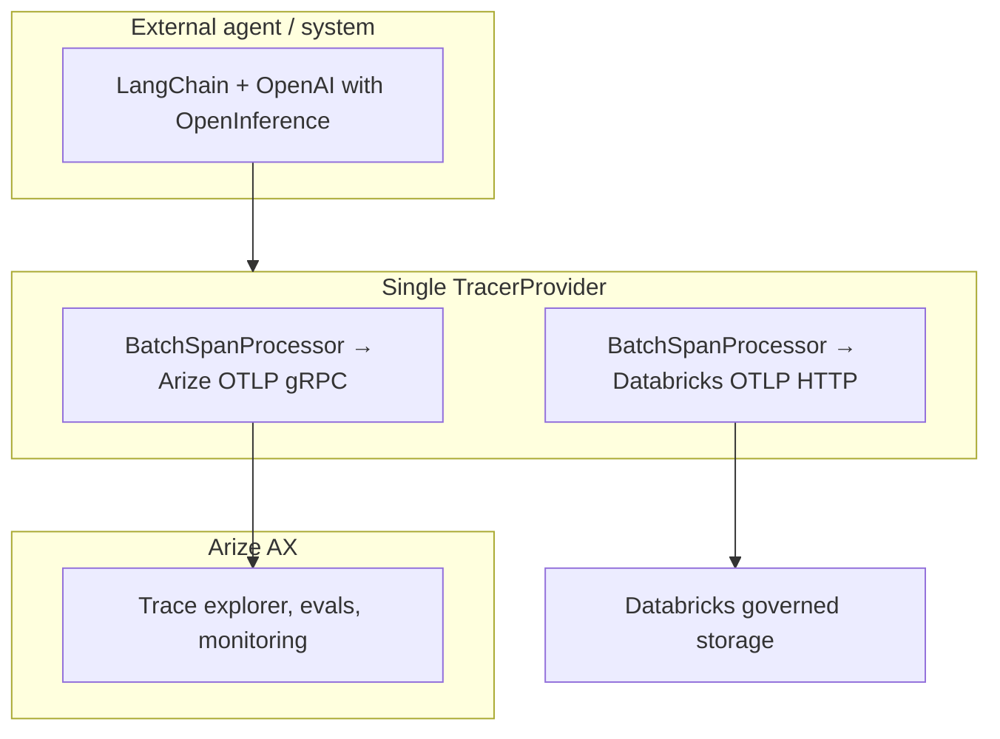

# Databricks × Arize: dual OTel ingest (partner notebook)

Partner/customer notebook that demonstrates **split-stream OpenTelemetry tracing**:

- **Stream 1 — Arize AX:** OTLP spans (gRPC) for real-time AI observability.
- **Stream 2 — Databricks:** OTLP spans into **Unity Catalog** Delta tables for governed storage and SQL analytics.

The demo uses an **external-style** OpenAI + LangChain agent with OpenInference auto-instrumentation.

## Repository layout

| File | Description |
|------|-------------|
| `notebooks/dual_ingest_external_otel.ipynb` | **Self-contained** Databricks notebook (working partner demo) |
| `notebooks/diagnose_arize_export.py` | Optional Arize-only connectivity test |

## Quick start

1. Import this repo as a [Databricks Repo](https://docs.databricks.com/en/repos/index.html) **or** upload/copy the single notebook file.
2. Open `notebooks/dual_ingest_external_otel.ipynb` on a cluster with internet access.
3. Set cluster env vars: `ARIZE_SPACE_ID`, `ARIZE_API_KEY`, `DATABRICKS_TOKEN`, `OPENAI_API_KEY`.
4. Set widgets (catalog, schema, SQL warehouse ID, Arize project name).
5. **Run all** cells.

No separate `requirements.txt` or helper modules are required — dependencies install via `%pip` in cell 1; dual-export helpers live in cell 4.

## Prerequisites

- Unity Catalog workspace with [OpenTelemetry on Databricks](https://docs.databricks.com/aws/en/mlflow3/genai/tracing/trace-unity-catalog) preview enabled
- UC permissions: `USE CATALOG`, `USE SCHEMA`, `CREATE SCHEMA` (if needed), `MODIFY` + `SELECT` on OTel tables
- SQL warehouse ID with `CAN USE`
- Arize **Space ID** + **Space API key** ([Space API keys](https://app.arize.com/organizations/-/settings/space-api-keys))
- OpenAI API key

## Architecture

## Lakebase consumption pattern

Use **Databricks SQL** on UC span tables for analytics. For operational apps, treat UC as the system of record and expose a permissioned read path via [Lakebase](https://docs.databricks.com/en/lakebase/) if sub-second app reads are needed.

## Troubleshooting

| Symptom | Fix |
|---------|-----|
| No Arize traces | Arize uses **gRPC** by default (`ARIZE_TRANSPORT=grpc`). Run `diagnose_arize_export.py` to isolate. |
| No UC rows | Check `DATABRICKS_TOKEN`, UC permissions, OTel preview enabled |
| `Invalid URL 'Endpoint.ARIZE'` | Remove bad `ARIZE_COLLECTOR_ENDPOINT` env var or set a real HTTPS URL |
| Spark display error on `attributes` | Query scalar columns or `resource.attributes[...]` only |

## Related docs

- [Store OpenTelemetry traces in Unity Catalog](https://docs.databricks.com/aws/en/mlflow3/genai/tracing/trace-unity-catalog)
- [Arize LangChain integration](https://arize.com/docs/ax/integrations/python-agent-frameworks/langchain)
