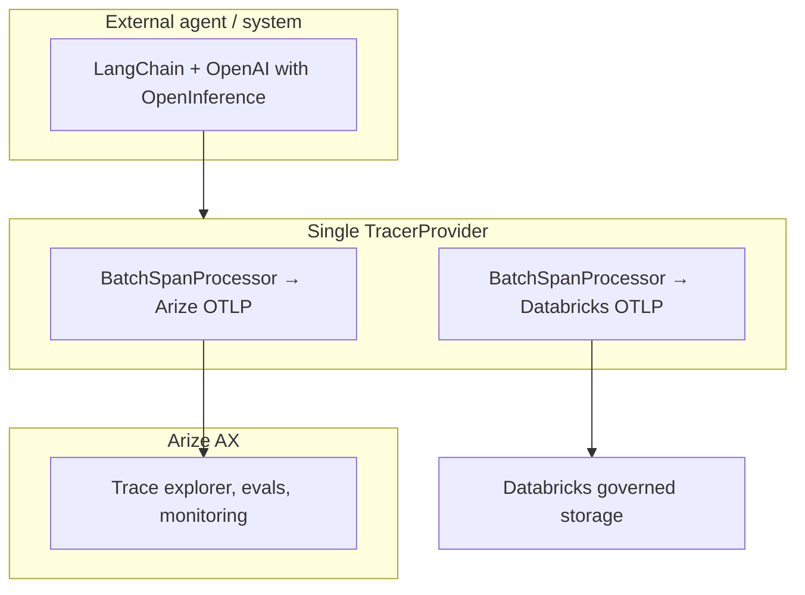

# Databricks × Arize: Path 2 dual OTel ingest (partner notebook)

Partner/customer notebook that demonstrates **split-stream OpenTelemetry tracing**:

- **Stream 1 — Arize AX:** OTLP spans for real-time AI observability (debugging, evaluation, monitoring).
- **Stream 2 — Databricks:** OTLP spans into **Unity Catalog** Delta tables for governed storage, retention, and analytics.

The demo uses an **external-style** OpenAI + LangChain agent (not Databricks-native auto-persist). The same trace payload is exported to both destinations from a single `TracerProvider`.

## Architecture

## Repository layout

| Path | Description |
|------|-------------|
| `notebooks/path2_dual_ingest_external_otel.py` | Databricks notebook (run on cluster) |
| `dual_export.py` | Dual OTLP `TracerProvider` helper (spans only) |
| `requirements.txt` | Cluster `%pip` dependencies |

## Prerequisites

1. **Databricks workspace** with Unity Catalog and previews enabled:
   - [OpenTelemetry on Databricks](https://docs.databricks.com/aws/en/mlflow3/genai/tracing/trace-unity-catalog)
   - Variant shredding (per public docs)
2. **Permissions** on the target catalog/schema:
   - `USE_CATALOG`, `USE_SCHEMA`
   - `MODIFY` and `SELECT` on all OTel trace tables (`ALL_PRIVILEGES` is not sufficient)
3. **Credentials** (cluster env or secret scope):
   - `ARIZE_SPACE_ID`, `ARIZE_API_KEY`
   - `DATABRICKS_HOST` (workspace URL, e.g. `https://dbc-xxx.cloud.databricks.com`)
   - `DATABRICKS_TOKEN` (PAT with UC write access to span tables)
   - `OPENAI_API_KEY`
4. **SQL warehouse** ID with `CAN USE` (widget in notebook)

## Deploy and run

1. Clone or import this repo as a [Databricks Repo](https://docs.databricks.com/en/repos/index.html) (recommended so `dual_export.py` is on `PYTHONPATH`).
2. Open `notebooks/path2_dual_ingest_external_otel.py` on a cluster with network access to OpenAI and your workspace OTLP endpoint.
3. Set widgets (`catalog_name`, `schema_name`, `table_prefix`, `sql_warehouse_id`, etc.).
4. Run all cells.
5. Verify:
   - **UC:** SQL results in section 7 (`*_otel_spans`).
   - **Arize:** Project named in `arize_project_name` widget.

## Lakebase consumption pattern

This notebook does **not** configure Lakebase. For operational apps that need low-latency access to recent traces while keeping UC as the system of record:

1. **Ingest** — Continue OTLP export to UC span tables (as in this notebook).
2. **Query in place** — Use **Databricks SQL** or Spark for analytics, compliance, and batch pipelines (shown in the notebook).
3. **Operational read path (Lakebase)** — When building a customer-facing or internal app on [Lakebase](https://docs.databricks.com/en/lakebase/), treat UC OTel span tables as the governed source and expose a narrow, permissioned API or synced projection for the app tier—for example:
   - Scheduled or incremental reads from `{catalog}.{schema}.{prefix}_otel_spans` filtered by `trace_id`, time range, or service attributes.
   - Materialize a small “hot” subset into a Lakebase-friendly store if your app needs sub-second reads and cannot query the warehouse directly.

Use SQL/Spark for **analytics and governance**; use Lakebase when you need an **application-integrated, operational** read model on top of the same governed trace data.

## Related documentation

- [Store OpenTelemetry traces in Unity Catalog](https://docs.databricks.com/aws/en/mlflow3/genai/tracing/trace-unity-catalog)
- [Third-party OTel client](https://docs.databricks.com/aws/en/mlflow3/genai/tracing/trace-unity-catalog?language=Third-party+OTel+client)
- [Arize LangChain integration](https://arize.com/docs/ax/integrations/python-agent-frameworks/langchain)

## Troubleshooting

| Symptom | Check |
|---------|--------|
| No Arize traces | `ARIZE_*` env vars; `arize_project_name` widget; flush cell ran |
| No UC rows | `X-Databricks-UC-Table-Name` matches `full_otel_spans_table_name`; PAT has MODIFY on spans table; previews enabled |
| `register` / processor issues | This repo uses stdlib `TracerProvider` + two processors (see `dual_export.py`), not `arize.otel.register()` + `add_span_processor` |
| Empty SQL after 15s | Increase sleep; check workspace region and OTLP rate limits |

## Scope

- **In scope:** Spans only (no dual export of logs/metrics).
- **Out of scope:** ZeroBus-specific ingest, Path 1 external tables, Path 3 read-from-UC connector.
